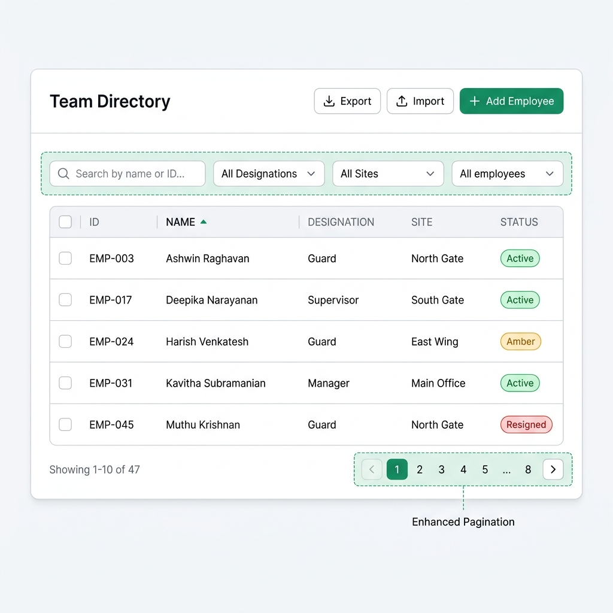
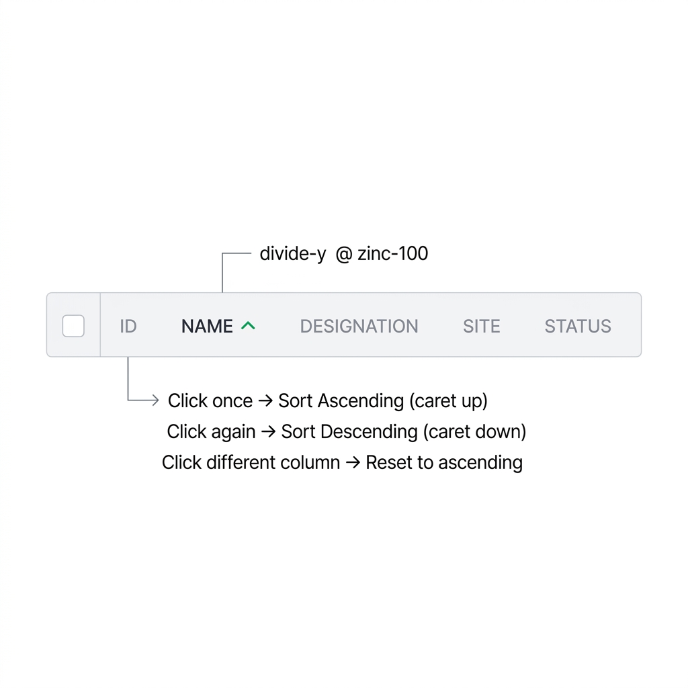
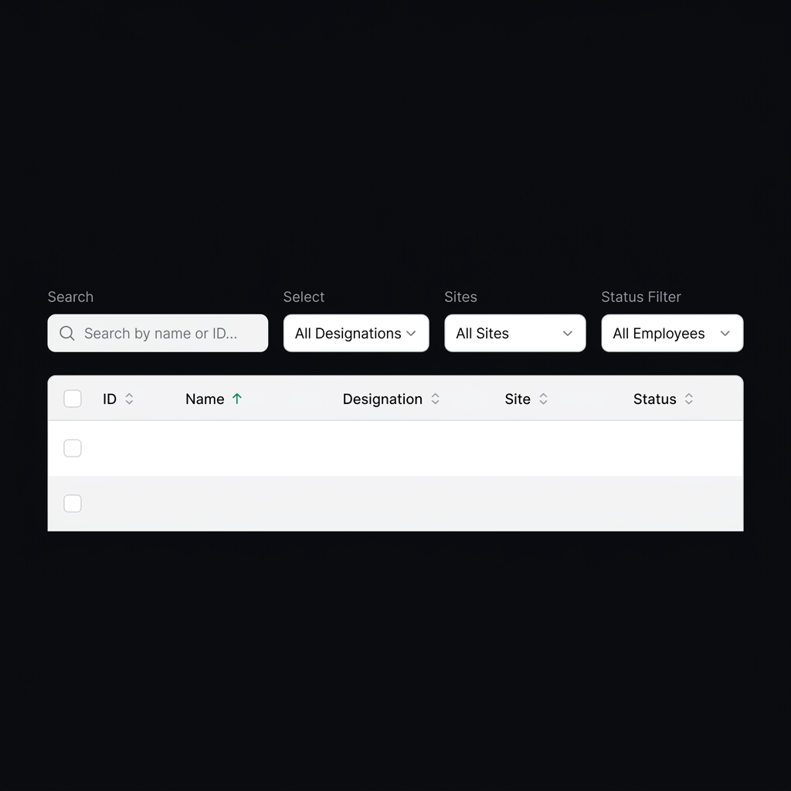
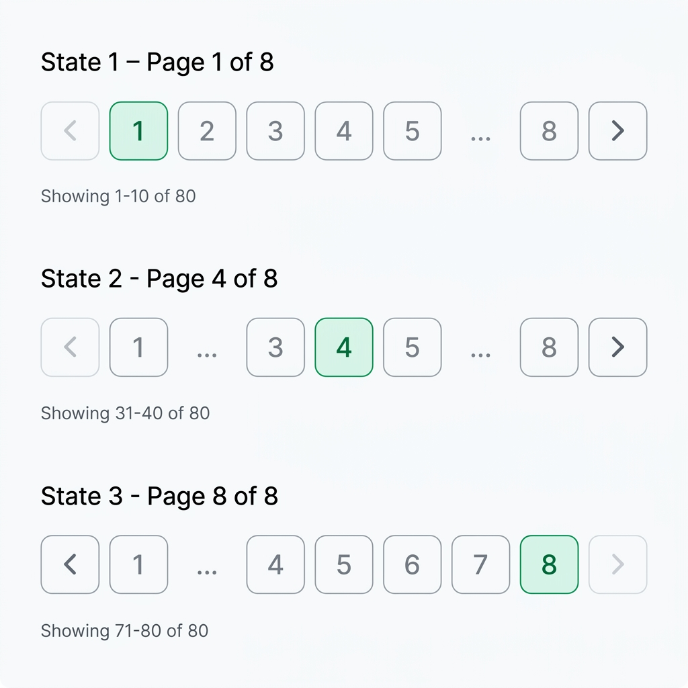

# E02 — UI Wireframes

> **Enhancement:** Sorting, Filtering & Pagination
> **Design System:** Zinc neutral base, Emerald-600 accent, Geist/Satoshi font stack
> **Tailwind Version:** v4

---

## Complete Enhanced View

The full Team Directory page with all three enhancements applied:



### Key changes from current implementation:
1. **Filter bar** gains two new dropdowns (Designation, Site) between Search and Status
2. **Column headers** become interactive sort controls with caret indicators
3. **Pagination** uses a sliding window algorithm instead of static 1-5

---

## Enhancement 1 — Sortable Column Headers



### Design Specifications

| Element | Current | Enhanced |
|---|---|---|
| Header element | Static `<th>` | Interactive `<button>` inside `<th>` |
| Active header text | `text-zinc-400` | `text-zinc-700 font-medium` |
| Inactive header text | `text-zinc-400` | `text-zinc-400` (unchanged) |
| Sort indicator | None | `CaretUp` / `CaretDown` icon from `@phosphor-icons/react` |
| Indicator color | N/A | `text-emerald-600` |
| Indicator size | N/A | `size={12}` |
| Cursor | `default` | `cursor-pointer` |
| Hover state | None | `hover:text-zinc-500` on inactive headers |
| Active press | None | `active:scale-[0.98]` on the button |
| Transition | None | `transition-colors duration-200` |

### Sort Header Anatomy

```
┌─────────────────────────────────────────────────────────────────────┐
│  ☐  │  ID  │  NAME ▲  │  DESIGNATION  │  SITE  │  STATUS          │
│     │ zinc │ zinc-700 │   zinc-400    │zinc-400│  zinc-400         │
│     │ -400 │ emerald  │              │        │                    │
│     │      │ caret    │              │        │                    │
└─────────────────────────────────────────────────────────────────────┘
```

### Sort Toggle Behaviour

```
State 1: No column sorted (default: Name ASC — but visually indicated)
         NAME shows ▲ (CaretUp) in emerald-600

State 2: User clicks ID header
         NAME loses indicator
         ID shows ▲ (CaretUp) in emerald-600
         Data re-sorted by Employee ID ascending

State 3: User clicks ID header again  
         ID shows ▼ (CaretDown) in emerald-600
         Data re-sorted by Employee ID descending

State 4: User clicks DESIGNATION header
         ID loses indicator
         DESIGNATION shows ▲ (CaretUp) in emerald-600
         Data re-sorted by Designation ascending
```

### Tailwind Classes for Sort Header Button

```
// Inactive header
className="inline-flex items-center gap-1 text-xs font-medium 
           uppercase tracking-wider text-zinc-400 
           hover:text-zinc-500 cursor-pointer 
           transition-colors duration-200 active:scale-[0.98]"

// Active header
className="inline-flex items-center gap-1 text-xs font-medium 
           uppercase tracking-wider text-zinc-700 
           cursor-pointer transition-colors duration-200 
           active:scale-[0.98]"
```

---

## Enhancement 2 — Designation & Site Filter Dropdowns



### Filter Bar Layout

```
┌──────────────────────────────────────────────────────────────────────────┐
│  🔍 Search by name or ID...  │ All Designations │ All Sites │ All emp. │
│  ◄── flex-1 ──────────────►  │ ◄── w-[180px] ►  │ w-[180px] │ w-[180px]│
└──────────────────────────────────────────────────────────────────────────┘
  gap-3 between all elements
```

### New Dropdown Specifications

Both new dropdowns follow the exact same styling as the existing Status filter:

| Property | Value |
|---|---|
| Width | `w-[180px]` |
| Padding | `px-3 py-2` |
| Font size | `text-sm` |
| Border radius | `rounded-xl` |
| Border | `border border-zinc-200/60` |
| Background | `bg-white` |
| Text color | `text-zinc-900` |
| Focus ring | `focus:ring-2 focus:ring-emerald-500/20 focus:border-emerald-500` |
| Transition | `transition-colors duration-200` |

### Designation Dropdown Options

```html
<select id="employee-designation-filter">
  <option value="ALL">All Designations</option>
  <!-- Dynamically populated from database -->
  <option value="Guard">Guard</option>
  <option value="Supervisor">Supervisor</option>
  <option value="Manager">Manager</option>
</select>
```

### Site Dropdown Options

```html
<select id="employee-site-filter">
  <option value="ALL">All Sites</option>
  <!-- Dynamically populated from database -->
  <option value="North Gate">North Gate</option>
  <option value="South Gate">South Gate</option>
  <option value="East Wing">East Wing</option>
  <option value="Main Office">Main Office</option>
</select>
```

### Responsive Behaviour

On viewports below `md` (768px), the filter bar should stack vertically:

```
Mobile layout:
┌────────────────────────────┐
│ 🔍 Search by name or ID...│  ← full width
├────────────────────────────┤
│ All Designations  ▾       │  ← full width
├────────────────────────────┤
│ All Sites  ▾              │  ← full width
├────────────────────────────┤
│ All employees  ▾          │  ← full width
└────────────────────────────┘
```

The filter bar container changes from `flex items-center gap-3` to:
```
className="flex flex-col md:flex-row items-stretch md:items-center gap-3"
```

Each dropdown changes from `w-[180px]` to `w-full md:w-[180px]`.

---

## Enhancement 3 — Dynamic Sliding Window Pagination



### Pagination Layout

```
┌─────────────────────────────────────────────────────────────────────┐
│ Showing 1-10 of 80                    [<] 1 2 3 4 5 ... 8 [>]     │
│ ◄── text-sm zinc-500 ──►             ◄── page buttons ──────────►  │
└─────────────────────────────────────────────────────────────────────┘
```

### Sliding Window States (8 total pages)

```
Page 1:  [<·] [1] [2] [3] [4] [5] [...] [8] [>]
Page 2:  [<]  [1] [2] [3] [4] [5] [...] [8] [>]
Page 3:  [<]  [1] [2] [3] [4] [5] [...] [8] [>]
Page 4:  [<]  [1] [...] [3] [4] [5] [...] [8] [>]
Page 5:  [<]  [1] [...] [4] [5] [6] [...] [8] [>]
Page 6:  [<]  [1] [...] [4] [5] [6] [7] [8] [>]
Page 7:  [<]  [1] [...] [4] [5] [6] [7] [8] [>]
Page 8:  [<]  [1] [...] [4] [5] [6] [7] [8] [>·]

[·] = disabled
[1] = highlighted active page (emerald)
[...] = non-clickable ellipsis
```

### Element Specifications

| Element | Classes |
|---|---|
| **Page button (inactive)** | `w-8 h-8 text-sm rounded-lg font-medium text-zinc-500 hover:bg-zinc-100 hover:text-zinc-900 transition-colors` |
| **Page button (active)** | `w-8 h-8 text-sm rounded-lg font-medium bg-emerald-50 text-emerald-700` |
| **Arrow button (enabled)** | `p-1.5 rounded-lg text-zinc-500 hover:text-zinc-900 hover:bg-zinc-100 transition-colors` |
| **Arrow button (disabled)** | `p-1.5 rounded-lg text-zinc-500 opacity-30 cursor-not-allowed` |
| **Ellipsis** | `w-8 h-8 inline-flex items-center justify-center text-sm text-zinc-300 cursor-default select-none` |
| **Showing text** | `text-sm text-zinc-500` |

### Ellipsis Markup

The ellipsis is a non-interactive `<span>`, not a `<button>`:

```html
<span 
  className="w-8 h-8 inline-flex items-center justify-center 
             text-sm text-zinc-300 cursor-default select-none"
  aria-hidden="true"
>
  ...
</span>
```

---

## Colour Reference

| Token | Hex | Usage |
|---|---|---|
| `zinc-50` | `#fafafa` | Header row bg, search input bg |
| `zinc-100` | `#f4f4f5` | Hover state for buttons |
| `zinc-200` | `#e4e4e7` | Borders |
| `zinc-300` | `#d4d4d8` | Ellipsis text |
| `zinc-400` | `#a1a1aa` | Inactive header text, placeholder text |
| `zinc-500` | `#71717a` | Body text, pagination info |
| `zinc-700` | `#3f3f46` | Active header text |
| `zinc-900` | `#18181b` | Primary text, heading |
| `emerald-50` | `#ecfdf5` | Active page button bg |
| `emerald-600` | `#059669` | Primary action buttons, sort indicators |
| `emerald-700` | `#047857` | Active page button text, hover states |

---

## Icon Reference (from @phosphor-icons/react)

| Icon | Usage |
|---|---|
| `CaretUp` | Sort ascending indicator |
| `CaretDown` | Sort descending indicator |
| `CaretLeft` | Previous page button |
| `CaretRight` | Next page button |
| `MagnifyingGlass` | Search input (existing) |

All icons use `size={16}` for navigation, `size={12}` for sort indicators. Weight: `regular` (default).
